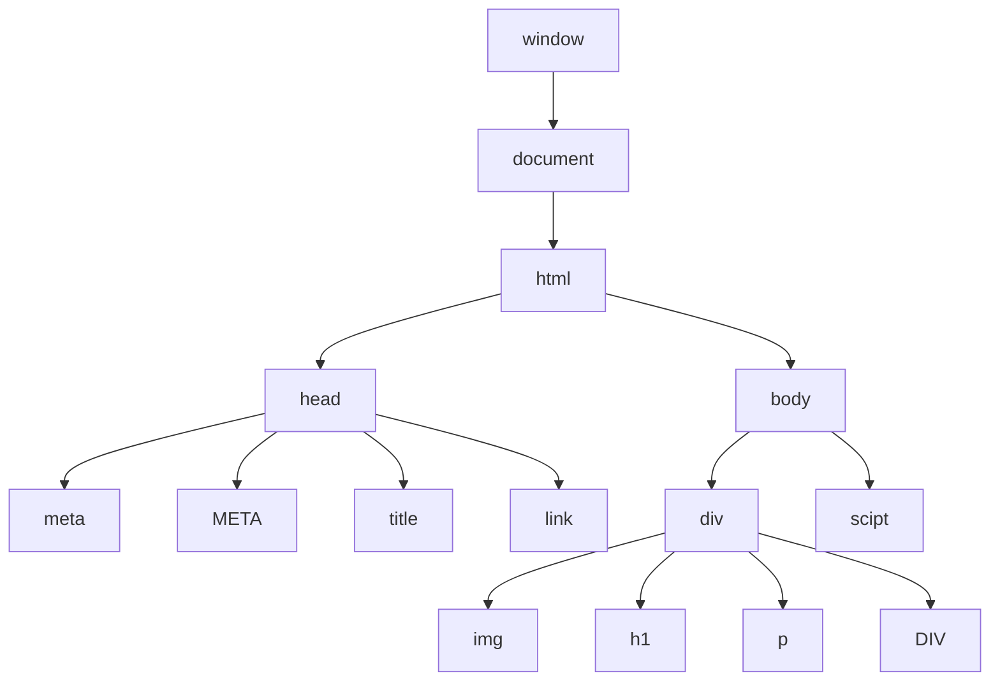

# JavaScript-Learning
demo repo to save the javascript programming learning in git

# DOM - Document Object Model
# window => 
its a object of a open window, created by a browser with many properties 

When  web page is loaded, the browser creates a DOM of the page 

# DOM Manipulation
1. Selecting with ID - getElementById. 
2. Selecting with Class - getElement**s**ByClass. 
3. Selecting with tag - getElement**s**ByTagName. 

# better than above methods is Query selector methods
1. document.querySelector("id/class/tag") 
    returns the first element and for class . is used and for id # is used

2. document.querySelectorAll("id/class/tag") 
    returns a NodeList

# properties:
tagName : returns tag for element nodes 
innerText : returns the text content of the element and all its children (only text not tags) 
innerHTML : returns the plain text or HTML content in the element(text and tags also) 
textContent :  return textual content even for hidden elements. 